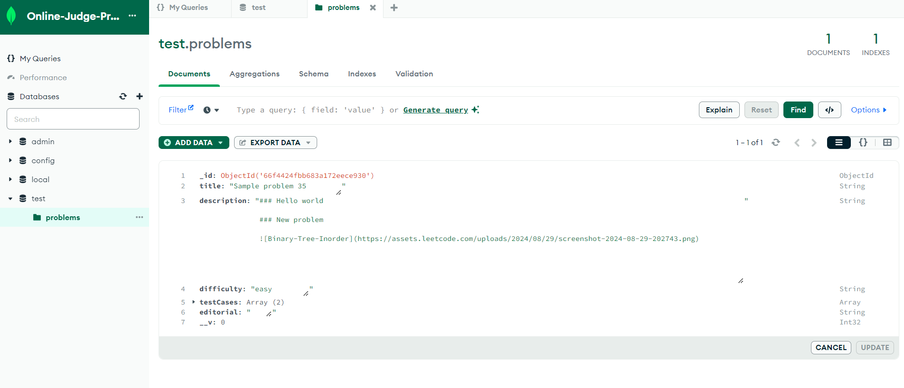
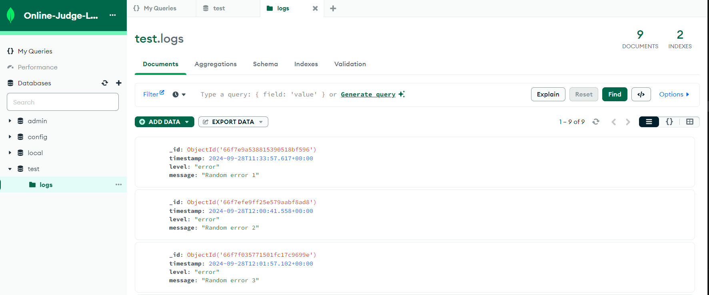
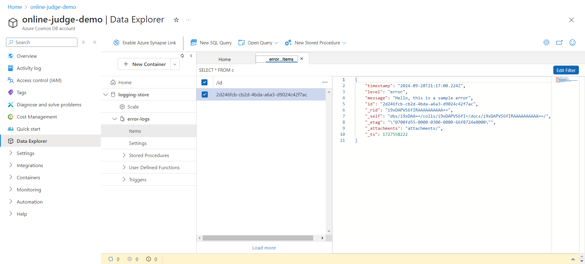

## Online Judge Problem Service

Problems Service which is used to perform CRUD operations on problems in the platform. 

Some noteworthy features are:

1. Sanitization of the problem (input markdown) before inserting or updating in the database

2. Setting up logging library for console, flat file, MongoDB and Azure CosmosDB transports

